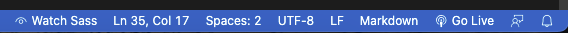
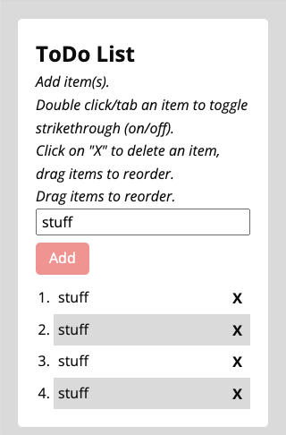
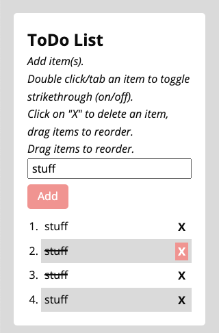
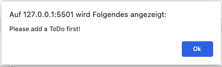

# ToDo List with jQuery

### What is this about?

This ToDo List was build as a mini project for Achievement 1 in [Career Foundry's Full-Stack Web Development Program](https://careerfoundry.com/en/courses/become-a-web-developer/).  
It is a (responsive) web application where a user can add items, cross out items, delete items, change order of items via drag and drop.  

[Click here to jump to the bottom to see screenshots](#Screenshots)

### Provided upfront

- HTML (list items generated dynamically)
- CSS
- vanilla JavaScript
- [See Replit here](https://replit.com/@CFCurriculum/jQuery-to-do-list#index.html)

### Requirements

- change provided vanilla JavaScript to jQuery (via CDN)

The ToDo List needs to have following features:

- user can add a new item (to a list of items)
- user can cross out an item (via click, styling)
- user can delete an item (via click, styling display none)
- user can change the order of items (via drag and drop)

### Nice to have, requirements by myself

- mobile first (starting at 320px)
- SCSS

### Languages, Libraries, Frameworks

- HTML
- S/CSS
- JavaScript
- jQuery (via CDN)

### Sources

- [jQuery via CDN](https://releases.jquery.com/)

### Tools, Extensions

- Visual Studio Code
- GitHub / [ToDo List on GitHub Pages](https://ellypirelly.github.io/todo-list-jquery/)
- [Visual Studio Extension "Live Server"](https://marketplace.visualstudio.com/items?itemName=ritwickdey.LiveServer)
- [Visual Studio Extension "Live Sass Compiler"](https://marketplace.visualstudio.com/items?itemName=glenn2223.live-sass)

### How to run this?

At time of writing, there's no npm packages or a build workflow present

- clone the repo
- `cd` into project
- if on Visual Studio Code, install "Live Server" extension, go to bottom menu and click "Go Live":  
    
- this is going to open the ToDo List on localhost http://127.0.0.1:5500/

### How to add Sass

- via command line, unless you already have it, run `npm install -g scss`
  - see more info here: [install Sass](https://sass-lang.com/install)
- on Visual Studio Code, install "Live Sass Compiler" extension, this will add a functionality you can comfortably reach via click on "Watch Sass":  
  
  - this will run a watcher in your terminal, and will compile everything you do in your `styles.scss` into a `styles.css`
  - you can now work with your `style.scss`

### Screenshots

#### 320px

  
