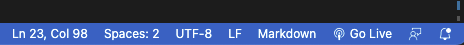

# ToDo List with jQuery

### What is this about?
This ToDo List was build as a task for Achievement 1 in [Career Foundry's Full-Stack Web Development Program](https://careerfoundry.com/en/courses/become-a-web-developer/).  
It is a web application, build with HTML, S/CSS and jQuery.  
See additional sources here:
- [jQuery](https://jquery.com/)
- [Download jQuery](https://jquery.com/download/)
- [jQuery CDN](https://releases.jquery.com/)

### Requirements
HTML to display added items will be generated dynamically, depending on amount of ToDos filled in.  
jQuery will be refactored off of a given JavaScript file.  

The ToDo List has following features:
- user can add a new item (to a list of items)
- user can cross out an item (via click, styling)
- user can delete an item (via click, styling display hidden)
- user can change the order of items (via drag and drop)

### Tools
- Visual Studio Code
- GitHub / GitHub Pages
- HTML, S/CSS, JavaScript
- SCSS optional (!)
- jQuery via CDN
- [Visual Studio Extension "Live Server"](https://marketplace.visualstudio.com/items?itemName=ritwickdey.LiveServer)
- [Visual Studio Extension "Live Sass Compiler"](https://marketplace.visualstudio.com/items?itemName=glenn2223.live-sass)

### How to run this?
At time of writing, there's no npm packages or a build workflow present
- clone the repo
- `cd` into project
- if on Visual Studio Code, install "Live Server" extension, go to bottom menu and click "Go Live":  
  
- this is going to open the website on localhost http://127.0.0.1:5500/
- TODO: add Sass