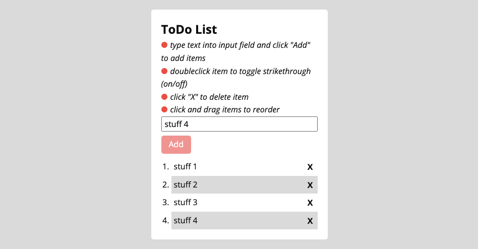

# ToDo List with jQuery

### What is this about?

This ToDo List has been built as a mini project for Achievement 1, exercise 9, in [Career Foundry's Full-Stack Web Development Program](https://careerfoundry.com/en/courses/become-a-web-developer/).  
It is a very small and simple, responsive web application that uses jQuery, where a user can add items, cross out items, delete items, change order of items via drag and drop.

[Click here to see the website on GitHub pages](https://ellypirelly.github.io/cf-todo-list-jquery/)

### Project requirements

- change upfront provided vanilla JavaScript to jQuery (via CDN), [see provided Replit here](https://replit.com/@CFCurriculum/jQuery-to-do-list#index.html)
- keep the upfront provided dynamically generated list items and the HTML
- as a start, keep the upfront provided CSS
- the ToDo List needs to have following features:
  - user can add a new item
  - user can cross out an item (via click, styling text-decoration line-through)
  - user can delete an item (via click, styling display none)
  - user can change the order of items (via drag and drop)

### Nice to have, requirements by myself

- mobile first (starting at 320px)
- SCSS

### Languages, Libraries, Frameworks

- HTML
- S/CSS
- JavaScript
- jQuery (via CDN)

### Sources

- [how to install Sass](https://sass-lang.com/install)

### Tools, Extensions

- Visual Studio Code
- GitHub / [ToDo List on GitHub Pages](https://ellypirelly.github.io/cf-todo-list-jquery/)
- [jQuery via CDN](https://releases.jquery.com/)
- [Visual Studio Code Extension "Live Server"](https://marketplace.visualstudio.com/items?itemName=ritwickdey.LiveServer)
- [Visual Studio Code Extension "Live Sass Compiler"](https://marketplace.visualstudio.com/items?itemName=glenn2223.live-sass)

### How to run this?

No build workflow.

- clone the repo
- `cd` into project
- if on Visual Studio Code, install "Live Server" extension, go to bottom menu and click "Go Live":  
    
- this is going to open the ToDo List on localhost http://127.0.0.1:5500/

### How to add Sass

- via command line, unless you already have it, run `npm install -g scss`
  - see more info here: [install Sass](https://sass-lang.com/install)
- on Visual Studio Code, install "Live Sass Compiler" extension, this will add a functionality you can comfortably reach via click on "Watch Sass":  
  
  - this will run a watcher in your terminal, and will compile everything you do in your `styles.scss` into a `styles.css`
  - you can now work with your `style.scss`
